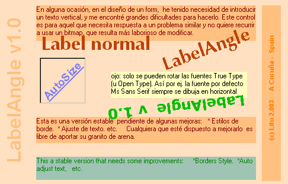



## Label Angle v1

### Description

Este es el 3º intento de subir este código, si no resulta, el que lo quiera que me lo solicite por e-mail. Saludos.

----

English

----

This is a control to draw a label rotate any degree. That give us more posibilities for te design of the forms.

----

Spanish

----

En alguna ocasión, en el diseño de un form, he tenido necesidad de introducir un texto vertical, y me encontré grandes dificultades para hacerlo. Este control es para aquel que necesita respuesta a un problema similar y no quiere recurrir a usar un bitmap, que resulta más laborioso de modificar.

Esta es una versión estable pendiente de algunas mejoras: * Estilos de borde. * Multilínea, etc.  Cualquiera que esté dispuesto a mejorarlo es libre de aportar su granito de arena.

----

English

----

This a stable version that needs some improvements: * Borders Styles. * Multiline, etc.

Enjoy
 
### More Info
 

             |
---                |---
**Submitted On**   |2004-01-04 10:15:38
**By**             |[Manuel Muñoz](https://github.com/Planet-Source-Code/PSCIndex/blob/master/ByAuthor/manuel-mu-oz.md)
**Level**          |Advanced
**User Rating**    |4.6 (133 globes from 29 users)
**Compatibility**  |VB 5\.0, VB 6\.0
**Category**       |[Custom Controls/ Forms/  Menus](https://github.com/Planet-Source-Code/PSCIndex/blob/master/ByCategory/custom-controls-forms-menus__1-4.md)
**World**          |[Visual Basic](https://github.com/Planet-Source-Code/PSCIndex/blob/master/ByWorld/visual-basic.md)
**Archive File**   |[Label\_Angl169115172004\.zip](https://github.com/Planet-Source-Code/manuel-mu-oz-label-angle-v1__1-50833/archive/master.zip)

